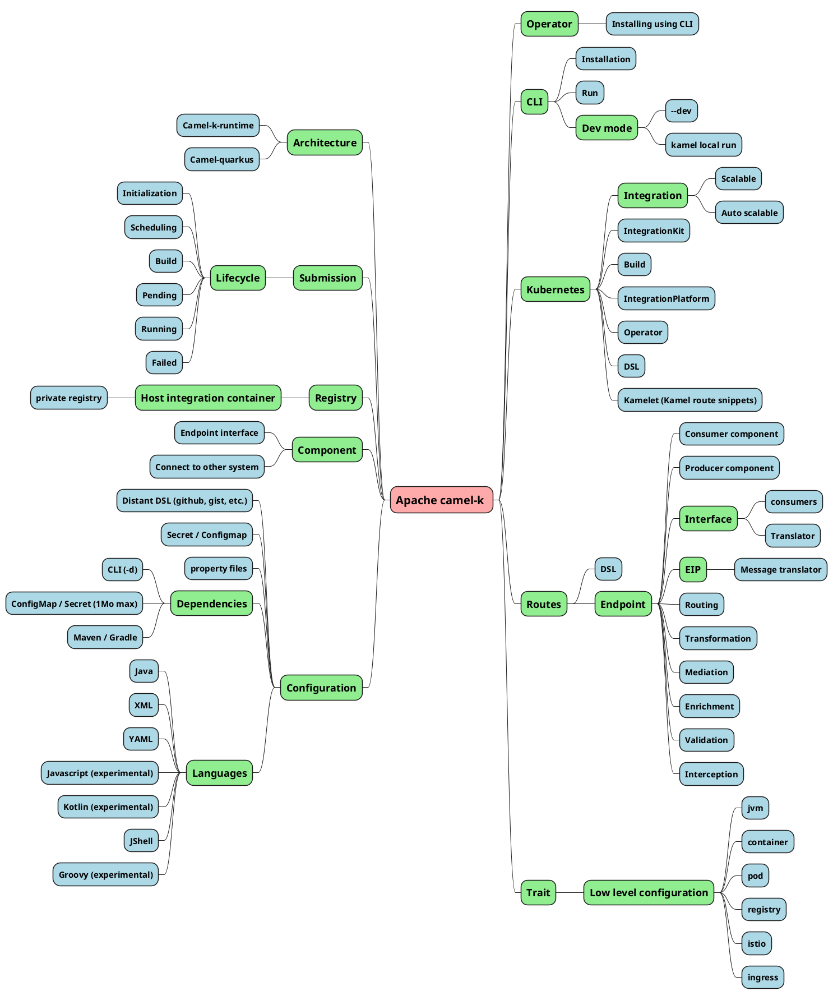

# Mindmap

```plantuml
@startmindmap
<style>
    mindmapDiagram {
      node {
        FontStyle Bold
        BackGroundColor lightgreen
        FontSize 18
      }
      rootNode {
        FontStyle Bold
        BackGroundColor #FFAAAA
        FontSize 20
      }
      leafNode {
        BackGroundColor lightblue
        FontColor black
        FontSize 15
      }
    }
</style>
+ Apache camel-k <<r>>
-- Architecture
--- Camel-k-runtime
--- Camel-quarkus

++ Operator
+++ Installing using CLI

-- Submission
--- Lifecycle
----  Initialization
----  Scheduling
----  Build
----  Pending
----  Running
----  Failed

++ CLI
+++ Installation
+++ Run
+++ Dev mode
++++ --dev
++++ kamel local run

-- Registry
--- Host integration container
---- private registry

++ Kubernetes
+++ Integration
++++ Scalable
++++ Auto scalable
+++ IntegrationKit
+++ Build
+++ IntegrationPlatform
+++ Operator
+++ DSL
+++ Kamelet (Kamel route snippets)

-- Component
--- Endpoint interface
--- Connect to other system

++ Routes
+++ DSL
+++ Endpoint
++++ Consumer component
++++ Producer component
++++ Interface
+++++ consumers
+++++ Translator
++++ EIP
+++++ Message translator
++++ Routing
++++ Transformation
++++ Mediation
++++ Enrichment
++++ Validation
++++ Interception

-- Configuration
--- Distant DSL (github, gist, etc.)
--- Secret / Configmap
--- property files

--- Dependencies
---- CLI (-d)
---- ConfigMap / Secret (1Mo max)
---- Maven / Gradle

--- Languages
---- Java
---- XML
---- YAML
---- Javascript (experimental)
---- Kotlin (experimental)
---- JShell
---- Groovy (experimental)

++ Trait
+++ Low level configuration
++++ jvm
++++ container
++++ pod
++++ registry
++++ istio
++++ ingress

@endmindmap
```
